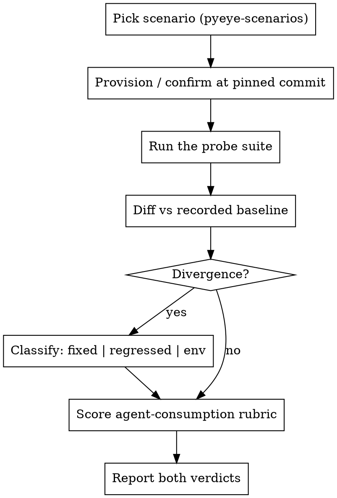

# pyeye Verify

A repeatable, scenario-independent procedure for two questions:

1. **Did pyeye regress?** — diff live probe output against a scenario's recorded baseline.
2. **How well does pyeye serve an AI agent?** — score the *shape* of the output against
   the agent-consumption rubric, not just whether it's correct.

The scenarios, pins, probe suites, and recorded baselines are the *data*, held in
**[[pyeye-scenarios]]**. This skill is the *procedure* that runs against any of them.

**Announce at start:** "Using the pyeye-verify skill to verify `<scenario>` on `<build>`."

## Why a skill harness, not pytest

This **complements** the pytest suite — it doesn't replace it. These scenarios hit *real
third-party repos at pinned commits* (too heavy for CI; never vendored), and the
agent-consumption rubric is *qualitative* (altitude, honesty, response shape) — awkward to
assert in pytest, natural for an agent rubric. Run on demand; not a CI gate. Distinct from
`python-explore` (user-facing tool mechanics) and the built-in `verify` (run-the-app).

## Procedure



1. **Pick a scenario** from [[pyeye-scenarios]] and **provision/confirm** it at its pinned
   commit (the scenarios skill has the commands). Note the **build under test** — the
   global server, or a delivery worktree's server — because baselines are build-tagged.
2. **Run the probe suite** verbatim, with the scenario's `project_path`.
3. **Diff vs the recorded baseline** (next section).
4. **Score the agent-consumption rubric** (section after).
5. **Report both verdicts** in the format below.

## 1. Regression check

Compare each probe's live result to the recorded baseline row. Every divergence is
**signal** — classify it, never wave it away:

| Classification | Meaning | Action |
|----------------|---------|--------|
| **Fixed** | a ❌ baseline row (known gap, tied to an issue) now passes | Update the baseline in [[pyeye-scenarios]], cite the issue/PR that fixed it, note the build |
| **Regressed** | a ✅ baseline row now fails | **File an issue** with the probe, expected vs actual, and the build; this is the harness's primary job |
| **Environment** | difference explained by the build under test, not behavior | Record against that build, tag the build; do NOT treat as a regression |

The classic *environment* case — now a confirmed before/after: the `namespace-jaraco`
edge-scope + cold-start rows returned `external` / `variable` / empty on the stale global
server (2026-06-21), then flipped to project-scoped handles once the server included the
fixes for #423/#444/#454 (2026-06-22). Same probes, different build — expected, not a
regression.

> A baseline row tied to an open issue is an **acceptance check**. When that issue's fix
> lands, this is where you confirm it on real code — exactly what happened for #444/#454 in
> the `namespace-jaraco` baseline.

## 2. Agent-consumption rubric

Correctness is necessary but not sufficient. Score the *shape* of each response — this is
pyeye's defensible axis (honesty + Python-depth). Each dimension is PASS / FAIL with the
probe evidence.

| Dimension | PASS looks like | FAIL looks like | Anchor example (from baselines) |
|-----------|-----------------|-----------------|----------------------------|
| **Absence vs zero** | empty/measured-none distinct from not-measured; missing `edge_counts` key ≠ `0` | a `0` that actually means "didn't measure", or empty conflated with unsupported | django inspect omits `callers` from `edge_counts` (absent ≠ 0) |
| **No content leakage** | pointers + structured facts; `file:line` to `Read` | source bodies / snippets in the response | every probe returns handles + locations, no source |
| **Honest limits** | reverse-reference edges *refuse* with a reason | faked/empty caller data, or grep/legacy-tool fallback | django `expand(…, "callers")` → `deferred_reference_backend` (#333) |
| **Right altitude** | cheap by default; truncation flagged (`truncated`, `max_nodes`) | firehose with no bound; silent truncation | jaraco `trace(imports)` caps at `max_nodes` with `truncated:true` |
| **Canonical handles** | re-exports collapse to definition site | alias path returned as the identity | `resolve("django.db.models.Model")` → `…base.Model` |
| **Static-surface honesty** | static result not claimed as runtime-exhaustive | a static `members` count sold as the complete runtime surface | django `members:68` excludes metaclass-injected `_meta`/`objects` |
| **Cross-repo correctness** | a symbol's `scope`/handle consistent across entry points | same symbol labelled differently by different primitives | ✅ #454: `resolve` and the `imports`/`callees` edges now agree (`project`) for namespace siblings |
| **Determinism** | same query → same result across runs | order/contents vary run-to-run | re-run a probe twice and compare |

The cross-repo row is a worked example of this rubric earning its keep — it surfaced #454.
A namespace sibling that was *also* pip-installed split scope across primitives:
`resolve("jaraco.context.ExceptionTrap")` reported `scope:"project"` while the same handle
inside `expand`/`trace(...imports)` reported `scope:"external"`, because Jedi's
`follow_imports` preferred the installed copy on the environment path. Issue #454 filed and
fixed it (`build_stub` reconciles an edge target's scope to the project definition site when
the canonical handle names a project module); the edges and `resolve` now agree. Kept here as
the canonical example of the cross-primitive inconsistency this dimension catches.

## Report format

```markdown
## pyeye verify — <scenario> on <build> (<date>)

**Regressions:** none | <list: probe, expected, actual, classification>
**Fixed since baseline:** <list, with issue/PR>
**Rubric:** <n>/8 PASS
  - <dimension>: PASS/FAIL — <one line of probe evidence>
**Actions:** <baseline updates, issues filed>
```

Lead with the regression verdict (it's the gate). Keep rubric findings to one evidence
line each — point at the probe, don't paste output.

## Red flags — you're misusing this skill

- Running probes **without provisioning at the pinned commit** — the baseline no longer
  applies.
- Treating a **build-explained** difference as a regression (or vice-versa) — always tag
  the build under test.
- Calling the rubric "all pass" **without probe evidence** per dimension.
- **Pasting source content** to "show" a result — that itself fails the no-leakage
  dimension.
- Quietly editing a baseline to make a diff disappear — a baseline change must cite the
  issue/PR and build that justifies it.
