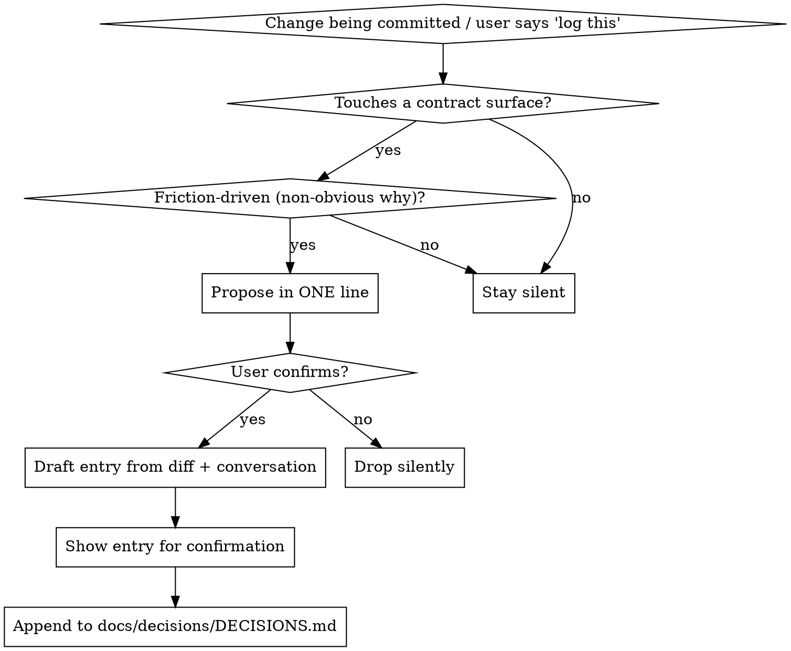

# Decision Log

Capture the *why* of contract-significant, friction-driven changes as small, **verifiable** notes — before the reasoning evaporates into the diff. Each entry is forward-compatible with a future trust-layer / architecture-fact checker that re-runs the `Verify` lines.

This habit must survive deadlines. It optimises for low friction and honest, checkable facts over completeness. Capturing a high-signal *subset* reliably beats capturing everything and rotting (the ADR graveyard).

## Skill Type: Mixed Rigid/Flexible

**Rigid gates (non-negotiable):**

- Propose in ONE line; never write the entry before the user confirms.
- Never nag — if the user declines, drop it silently and continue.
- `Verify` MUST be honestly tiered (gold / partial / unverifiable) — never a vague "looks right".
- `Anchor` MUST use stable references (symbol names, #issue/PR, commit-pinned permalinks) — NEVER a bare `file:line`.
- Never fabricate the date.

**Flexible path (use judgement):**

- Whether a given diff is genuinely "contract-significant" (when unsure, do NOT propose — false positives train the user to ignore you, which kills the habit).
- How to phrase Friction/Decision concisely.
- Which verification mechanism fits (test, pyeye query, grep, import-linter contract, human review).

## When This Fires

**Primary trigger — the commit checkpoint.** When a commit is being prepared and the staged diff touches a **contract surface**, propose ONE decision note before finalising. Contract surfaces:

- a public/exported signature changed (params, return, raises)
- a documented invariant or guarantee (e.g. "never raises", "pure consumer", "absence ≠ zero")
- a predicate / schema / config contract (a new key, a changed default)
- an edge / API contract (what a tool returns, a discriminated-union branch)
- a non-obvious "why we did it this way" decided in the working conversation

**Secondary trigger — on demand.** The user says "log this decision" (or similar), commit or not.

## Do NOT Trigger When

- Pure bugfix, rename, formatting, dependency bump — no contract change, no non-obvious why.
- A new test case only (not test-infrastructure contracts).
- The change is mechanical and self-explanatory from the diff.
- You are unsure it clears the contract-significant bar — default to silence.

## The Flow (propose → draft → confirm → append)

1. **Propose in ONE line.** e.g. *"That `stop_when` change alters a predicate contract — log a decision note?"* Do not draft yet.
2. **Draft from the diff + conversation.** Fill every field. Pull the *why* from what was actually said/decided, not a guess.
3. **Show the drafted entry** for confirmation.
4. **Append on confirm** to `docs/decisions/DECISIONS.md` (newest on top; create with the header if absent). On decline, drop it.

## Entry Schema

```text
## YYYY-MM-DD — <one-line title>
**Friction:** <the frustration that drove the change — what broke / didn't work / was unsafe>
**Decision:** <what was decided and chosen; the rejected alternative if non-obvious>
**Anchor:** <stable refs only — canonical symbol name(s) + #issue/PR or commit-pinned permalink>
**Verify:** <gold | partial | unverifiable — see below>
```

Keep each field to a line or two. A 6-line entry that gets written beats a 40-line ADR that doesn't.

## Honesty Discipline (what makes this more than prose)

The `Verify` line is the bridge to the trust layer. It MUST be one of three honestly-labelled tiers:

- **Gold (mechanically checkable):** a concrete assertion something can run — a test, a pyeye query, a grep, an import-linter contract. Precise enough to execute.
  `Verify: trace(<project handle>, ["callees"], stop_when={scope:"project"}) returns zero nodes with scope=="external".`
- **Partial:** the checkable portion as a gold assertion, plus the residue explicitly marked unverifiable.
  `Verify: PARTIAL — "module A imports B; B does not import A" via import-linter forbidden contract. "Must not mutate the registry" needs human/AST review.`
- **Unverifiable:** `Verify: unverifiable — <reason>.` Still record the intent; just be honest the checker can't confirm it.

**Environment caveats are part of honesty.** If a `Verify` depends on conditions that can make it lie (a warm semantic index, a built feature, a running service), say so inline — e.g. `[needs warm index]`. A `Verify` that silently fails on a cold index is a false alarm, not a verification.

## File Convention

- Location: `docs/decisions/DECISIONS.md` at the repo root. Create `docs/decisions/` if absent.
- Append-only, **newest entry on top**, one entry per *distinct* decision (not per commit; one commit may yield zero or one).
- When creating the file, start it with this header, then the first entry:

```text
# Decision Log

Contract/invariant-significant, friction-driven decisions. Each entry is a small verifiable fact: Friction · Decision · Anchor (stable ref) · Verify (checkable or honestly-labelled). Newest on top. Maintained via the `decision-log` skill.
```

## Workflow



## Date

Take the date from the environment (the session's current date, or `date +%F` / `git log`). NEVER fabricate it.

## Failure Mode

This skill has NO hard tool dependency. If a chosen `Verify` mechanism is unavailable (pyeye down, no import-linter, etc.):

1. Pick a different mechanism that IS available (grep, a test, human review), or
2. Drop the `Verify` to a lower tier and label it honestly (`partial` / `unverifiable — <reason>`).

Never invent a passing check. An honest `unverifiable` is correct; a fabricated gold assertion is a lie that will mislead the future checker.

## Red Flags — You're About to Violate This Skill

- Drafting the entry before the user confirmed.
- Proposing on a pure bugfix / rename / format / dep-bump.
- Writing `Verify: looks correct` or any assertion nothing can run.
- Using a bare `file:line` as the `Anchor`.
- Proposing a second time after the user already declined.
- Inventing a date or a passing check.

**If you catch yourself doing any of these: STOP.**
