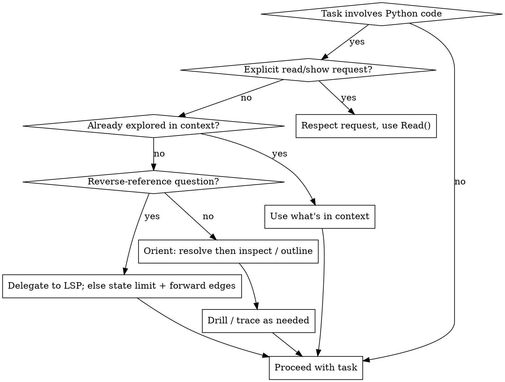

# Python Explore

Build a structural model of Python code with pyeye before reading or changing it —
**orient cheap, drill on demand.**

## The Model: Progressive Disclosure

pyeye answers questions in three widening steps. Start at the cheapest that answers
your question; only go wider when you need to.

1. **Orient (cheap):** `resolve` a name to a canonical handle, then `inspect` it for
   structure, or `outline` a module/class for its skeleton.
2. **Drill (on demand):** `expand` one edge from a handle to see its immediate
   neighbours (members, callees, importers, subclasses…).
3. **Trace (across hops):** `trace` follows edges multiple hops to see structure
   across a call chain, import closure, or member tree.

**Canonical handles are the currency.** A handle is Python's own dotted notation —
`a.b.c.Name` — anchored at the *definition site*, stable across edits, and the same
no matter which import alias you arrived through. Everything downstream takes a handle.
pyeye returns **pointers and structured facts, never source** — when you need the actual
code, `Read` the `file:line` it points you at.

## Skill Type: Mixed Rigid/Flexible

**Rigid gates (non-negotiable):**

- Your first move on unfamiliar Python is pyeye, not a blind `Read()`.
- Never re-explore what pyeye already surfaced in this conversation.

**Flexible (use judgement):**

- How deep to go (a single `inspect`, or a multi-hop `trace`).
- Which primitives and edges to call.
- Whether to write out a mental-model summary — do it when it helps the user, not as
  ceremony (see [Stating Your Mental Model](#stating-your-mental-model)).

## Do NOT Trigger When

- User says "show me", "print", "display", "read this file" — respect explicit requests,
  use `Read()`.
- User says "run", "execute" — that is not exploration.
- User asks "what's the syntax for" — a language question, not a codebase question.
- Single-line typo/string fix where the user gives the exact location.
- Adding a new test case only (not modifying the code under test).
- pyeye output for this symbol is already visible in conversation context — skip straight
  to using it.

## The Primitives

| Primitive | Use it to | Returns |
|-----------|-----------|---------|
| `resolve(identifier)` | Turn a name, dotted path, or `file:line` into a canonical handle | `{handle, kind, scope, location}` — or `{ambiguous, candidates}` |
| `resolve_at(file, line, column)` | Turn a position (stack frame, pasted line) into a handle | same shape as `resolve` |
| `inspect(handle)` | Answer "what is this?" — kind, signature, docstring, `edge_counts` | a structural Node, plus kind-dependent fields (e.g. `superclasses`, `re_exports`); no source |
| `outline(handle)` | See the structural skeleton of a module or class in one call | a tree of member stubs |
| `expand(handle, edge)` | Walk ONE edge to the immediate neighbours | a list of stubs |
| `trace(start, follow, …)` | Walk edges across multiple hops | a subgraph (nodes + edges) |

Notes that matter:

- `resolve` already includes a `location` pointer, so it answers "where is this defined?"
  on its own — you do **not** need a follow-up `inspect` just for location. Use `inspect`
  when you want signature/docstring/`edge_counts`.
- **Ambiguity:** a bare name can match several symbols. `resolve` then returns
  `{found: true, ambiguous: true, candidates: [...]}`, each candidate carrying
  `handle`/`kind`/`scope`/`location`. Pick the right one, or re-resolve with the full
  dotted handle.
- **`scope`** is `"project"` or `"external"`. Project symbols get full-graph answers;
  external symbols (stdlib, site-packages) get project-scoped answers — see the scope
  example below.
- **No source content, ever.** `inspect`/`outline`/`expand`/`trace` return pointers and
  structured facts. `Read` is the content layer.

## Supported Edges

`expand` and `trace` walk these edges. This is the **complete** set pyeye can answer
reliably today:

<!-- pyeye-supported-edges: members callees imported_by subclasses superclasses imports enclosing_scope submodules -->

| Edge | Direction | Meaning |
|------|-----------|---------|
| `members` | container → children | a class's methods/attributes, or a module's top-level defs |
| `submodules` | package → child modules/subpackages | a package's direct child modules and subpackages (one hop; full tree via `trace`) |
| `enclosing_scope` | child → parent | the one lexical scope containing this symbol (method → class, etc.) |
| `callees` | function → what it calls | forward call targets resolved from the body |
| `subclasses` | class → its direct subclasses | project classes that **directly** extend this class (one hop; full closure via `trace`) |
| `superclasses` | class → its bases | the class's direct base classes |
| `imports` | module → what it imports | the module's top-level imports |
| `imported_by` | module → its importers | project modules that import this module |

**Pointer-only stubs.** `subclasses` and `imported_by` stubs are *pointers*
(handle + location + kind) and intentionally omit `signature` — even though a
subclass stub's kind is `class`. Drill with `inspect(<handle>)` when you need a
subclass's constructor signature or docstring.

**Static-surface ceiling.** These structural edges are complete over what is
*written in source*, not over what exists at runtime. `members` / `outline` /
`subclasses` do not see runtime-injected relationships — metaclass injection,
`setattr`, `__getattr__`, `type(...)`, `__init_subclass__` registration, or
`importlib` with computed targets. So `outline` of a Django `Model` omits its
metaclass-injected `_meta` / `objects` / `DoesNotExist`, and the `subclasses`
edge (direct children) plus a `trace` subclass closure cover literal
`class B(A):` subclassing only. An absent member or subclass means "not in
source," **not** "not at runtime" — don't report a static result as
runtime-exhaustive. (Same boundary `imported_by` already names for dynamic
imports.)

## ⭐ Honest Limits — pyeye Has No Reverse References (Delegate to Your LSP)

This is the most important rule in this skill.

**"Who calls this?" and "what references this?" cannot be answered by pyeye** — delegate
them to your LSP (below). The
edges `callers`, `references`, `read_by`, `written_by`, `passed_by`, `overrides`,
`overridden_by`, `decorated_by`, and `decorates` are **deferred** — they need an indexed
reference backend (Pyright) that isn't wired up yet ([#333](https://github.com/okeefeco/pyeye-mcp/issues/333)).
When you ask for one, pyeye **refuses** (reports it as unsupported) rather than returning
a wrong or empty answer. Likewise, `inspect`'s `edge_counts` simply **omits** `callers`
and `references` — it does not report them as `0`.

**Do NOT fake reverse-reference data.** Delegating to a real reference backend (your
editor's LSP — see below) is *not* faking; these two cheats are:

- Do **not** fall back to `grep` to guess who calls or references a symbol.
- Do **not** use the deprecated legacy tools `find_references` or `get_call_hierarchy`
  to fill the gap. They are backed by exactly the reverse search the redesign rejected:
  it under-reports non-deterministically — anchored at a definition it can return a
  near-empty set for a heavily-used symbol. A confident wrong answer is worse than an
  honest "not available."

### The reliable path: delegate to your LSP

A real reference index is almost certainly already in your toolbox — a language-server
(LSP) tool backed by Pyright/Pylance (e.g. Claude Code's `LSP` tool). Use it. pyeye and
the LSP **compose**: pyeye hands you the definition-site `location` (`file:line:column`)
from `resolve` / `inspect` / `resolve_at` — exactly the position an LSP reference query
needs.

Pipeline for "who calls / references this?":

1. `resolve(name)` → canonical handle + `location {file, line_start, column_start}`.
2. Feed that position to the LSP: `findReferences`, `incomingCalls` (callers), or
   `goToImplementation`.
3. The LSP answers in positions; `resolve_at(file, line, column)` maps any of them back
   into pyeye handle space when you want to keep working there.

**Roles, not redundancy.** pyeye *drives* orientation, structure, and forward facts; the
LSP is the *reference specialist* you delegate the inbound questions to. Do **not** run
them as two interchangeable navigators, or consult both for the *same* fact — they infer
independently (Jedi vs Pyright) and can disagree, and two oracles voting erodes the trust
a single honest answer is for.

### When no LSP is available

If your harness has no language-server tool, **say so plainly**: "pyeye can't give
reliable caller/reference data (deferred to #333), and there's no LSP here to delegate
to." Then offer what you *can* answer — and still do **not** substitute grep or the
legacy tools:

- **Forward** from a function: `callees` (what it calls).
- **Around a module:** `imported_by` (who imports it) and `imports` (what it imports).
- **Inheritance:** `subclasses` / `superclasses`.
- **Structure:** `members`, `enclosing_scope`.

### Hit a pyeye bug or limitation? Report it in-band

pyeye tells you where to file. Every `unsupported` result from `expand`, and any
`trace` that names an unsupported edge, carries a `report_issues` URL. The
`pyeye://about` resource returns pyeye's version + repository + issues URL on
demand — fetch it instead of guessing the repo slug. If a limitation looks like a
real defect (not an expected static-surface ceiling), surface that URL to the user.

### Absence vs zero

When you read `edge_counts`, a **missing key means "not measured," not "zero."** A
present `superclasses: 0` means measured-and-none (the class has no bases). An *absent*
`callers` key means pyeye didn't measure it — don't read that as "no callers."

## Workflow



## Worked Examples

Handles below use a placeholder project (`myapp.…`) — substitute your own. The
`pathlib` example is real and works anywhere.

**"What is `Settings`?"** — orient in one or two calls:

```text
resolve("myapp.config.Settings")   -> { handle: "myapp.config.Settings", kind: "class",
                                        scope: "project", location: {...} }
inspect("myapp.config.Settings")   -> kind, signature, docstring,
                                        edge_counts: { members: 7, superclasses: 1 }
```

**Ambiguous name** — let `resolve` disambiguate, don't guess:

```text
resolve("Settings")  -> { ambiguous: true, candidates: [
                            { handle: "myapp.config.Settings", ... },
                            { handle: "myapp.cli.Settings", ... } ] }
```

Pick the candidate you meant, or re-resolve with the full dotted handle.

**"I'm looking at this line / stack frame — what is it?"** — position to handle:

```text
resolve_at("myapp/cache.py", line=42, column=8)  -> { handle: "myapp.cache.Cache.evict", ... }
```

**"What's inside this module?"** — skeleton in one call:

```text
outline("myapp.cache")  -> tree of (Cache, DependencyTracker, ...) with their methods
```

**Cold start: "what's in this package / project?"** — orient top-down, drill on
demand. `outline` on a *package* surveys its child modules/subpackages (depth-1
by default — subpackages marked `truncated: max_depth`, modules as leaves); pass a
higher `max_depth`, or `expand`/`trace` the `submodules` edge, to go deeper:

```text
resolve("myapp")                  -> { handle: "myapp", kind: "module", scope: "project" }
outline("myapp")                  -> direct submodules/subpackages (depth-1 survey)
expand("myapp.db", "submodules")  -> one hop of a subpackage's children
trace("myapp", follow=["submodules"], max_depth=3)  -> bounded package tree (capped + `truncated`)
```

Then drill: `resolve(root) → outline(pkg) | expand(pkg, "submodules") → pick a
module → inspect / expand("members") / trace`.

> **Cold-start limit — namespace-rooted packages.** The bare-name entry above
> (`resolve("myapp")`) is reliable for a **regular** package (one with an
> `__init__.py`). A PEP 420 **namespace** package (no `__init__.py` at its root)
> may surface as an `external`/`namespace` handle that `resolve`/`inspect` can't
> anchor, so `resolve("<name>")` can come back ambiguous/not-found and
> `inspect(<namespace-pkg>)` omits its `submodules` count — even though
> `expand(<namespace-pkg>, "submodules")` still enumerates children once you hold
> the handle. End-to-end namespace cold-start is deferred to #444; until then,
> orient a namespace package via a child handle you already know, or by resolving
> a concrete module inside it.

**"What does this function call?"** — forward, reliable:

```text
expand("myapp.cache.Cache.evict", edge="callees")  -> stubs for each call target
```

**"Who imports this module?"** — reverse, but reliably static:

```text
expand("myapp.cache", edge="imported_by")  -> module stubs that import myapp.cache
```

**"What subclasses this base?"** — inheritance down. `expand` returns the
**direct** children (one hop); for the full transitive closure use `trace` with
explicit bounds (the class result carries a static `transitive_hint` pointing
there):

```text
expand("myapp.plugins.Base", edge="subclasses")  -> project classes DIRECTLY extending Base
trace("myapp.plugins.Base", follow=["subclasses"], max_depth=3)
  -> bounded subtree of the full subclass closure (capped + `truncated`)
```

**Multi-hop closure** — structure across hops:

```text
trace(start="myapp.cache.Cache.evict", follow=["callees"], max_depth=3)
  -> subgraph of the 3-hop forward call structure
```

**Project vs external scope** — `pathlib.Path` is external, so subclasses come back
project-scoped:

```text
inspect("pathlib.Path")                      -> scope: "external", members/signature derived on demand
expand("pathlib.Path", edge="subclasses")    -> only classes in THIS project that extend Path
```

**"Who calls `Cache.evict`?"** — pyeye defers it; delegate to the LSP:

```text
resolve("myapp.cache.Cache.evict")   -> location: { file: "myapp/cache.py", line_start: 42, column_start: 8 }
# then hand that position to your LSP tool:
LSP.incomingCalls("myapp/cache.py", line=42, character=9)  -> real callers, with call sites
```

> pyeye doesn't index callers (deferred to #333), so I delegated: `resolve` gave the
> def-site location and the LSP's `incomingCalls` returned the real callers. (I can map
> any back to a handle with `resolve_at`.)

With **no** LSP tool in reach, the honest refusal instead:

> Reliable caller data isn't available — `callers` is deferred (#333), there's no LSP
> here to delegate to, and grep or the legacy tools would under-report. What I *can*
> show: what `Cache.evict` itself calls (`callees`), and which modules import
> `myapp.cache` (`imported_by`). Want either?

## Dependency & Coupling Analysis

Module relationships are answerable from two static edges — `imports` (what a
module depends on) and `imported_by` (which project modules depend on it) — plus
`trace(follow=["imports"])` for the multi-hop closure. From those you can compute
the standard coupling metrics by hand:

- **Fan-out (efferent):** size of `expand(mod, "imports")` — how many things this
  module depends on. High fan-out = many reasons to change = fragile.
- **Fan-in (afferent):** size of `expand(mod, "imported_by")` — how many project
  modules depend on this one. High fan-in = changes here are risky.
- **Instability:** `fan_out / (fan_in + fan_out)`. `0` = stable (depended on,
  depends on nothing); `1` = unstable (depends on others, nothing depends on it).
  Entry points sit near 1; core/shared modules near 0.

**Detecting cycles:** `trace(start=mod, follow=["imports"])`, then scan the
returned `edges` for one whose `to` is the start module. `trace` visits each node
once but still records edges back into already-visited nodes, so that back-edge is
exactly an `A → … → A` circular dependency. (Look in `edges`, not `nodes` — nodes
are deduped, so the start won't literally reappear.) Standard ways out: extract a
shared base module both can import, inject the dependency instead of importing it,
or move the import inside the function (lazy import).

**Reading the architecture:** a clean layered design shows imports flowing one
direction (API → services → models → external) with no back-edges; a "utility
hub" shows one low-instability module with high fan-in; a cycle is the
anti-pattern. Map a few key modules with `expand(…, "imports")` to see which
shape you have before refactoring.

> Same static-surface ceiling as everywhere else: dynamic imports
> (`importlib.import_module()`, plugin loaders, conditional imports) are invisible
> here — an absent edge means "not imported in source," not "never loaded."

## Stating Your Mental Model

When it helps the user — a non-trivial change, an ambiguous request, a risky edit —
state what you found before proceeding. Use **canonical handles + `file:line`** so the
user can correct you:

```markdown
**Mental model: `myapp.cache.Cache`** (`myapp/cache.py:31`)
- Depends on: `myapp.config.Settings`, `collections.OrderedDict`
- I can see: 7 members, 1 superclass (measured); subclasses on demand via `expand`
- Callers/references: pyeye defers them (#333) — get them from the LSP; without one, caller impact is unverified
```

Scale this to the task. A pure "how does X work?" answer may need no separate summary;
a refactor that touches shared code deserves one — and should be explicit that
caller impact can't be statically confirmed.

## Failure Mode

If pyeye is unavailable (server down, tools not responding):

1. Note it explicitly: "pyeye unavailable — falling back to `Read()`."
2. Proceed with `Read()`.
3. Warn that static structural analysis is unavailable.

Don't block — degrade gracefully, but make the limitation visible.

## Red Flags — You're About to Violate This Skill

- Your first tool call is `Read()` on a Python file you haven't oriented in pyeye.
- Reaching for `grep` to find a definition.
- Reaching for `grep` to answer a relationship/reference question.
- Reaching for deprecated `find_*` / `get_*` legacy tools.
- **Faking "who calls this" with grep or the legacy reference tools** instead of
  delegating to your LSP (or, with no LSP, stating the limit honestly).
- Re-exploring a symbol pyeye already surfaced in this conversation.

**If you catch yourself doing any of these: STOP. Orient with pyeye, or say honestly
what it can't answer.**
