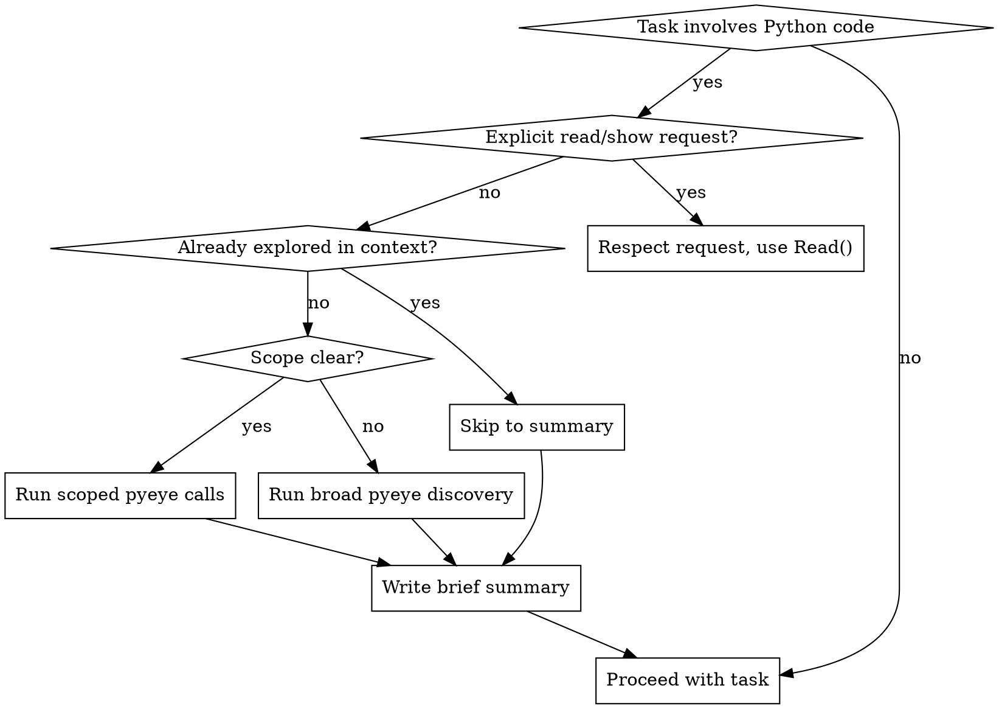

# Python Explore

Build a mental model with pyeye before touching Python code.

## Skill Type: Mixed Rigid/Flexible

**Rigid gates (non-negotiable):**

- Always produce a written summary before proceeding
- Always use pyeye before Read() on unfamiliar code
- Never re-explore what's already in context

**Flexible path (use judgement):**

- Depth scaling based on task scope
- Which specific pyeye calls to make
- When the mental model is "sufficient"

## Do NOT Trigger When

- User says "show me", "print", "display", "read this file" — respect explicit requests
- User says "run", "execute" — not exploration
- User asks "what's the syntax for" — language question, not codebase question
- Single-line typo/string fix where user gives exact location
- Adding a new test case (not modifying test infrastructure)
- Pyeye output for this module is already visible in conversation context

If pyeye output is already in context, skip to summary and proceed.

## Depth Scaling

| Task Scope | Pyeye Calls |
|------------|-------------|
| Single class/function change | `lookup()` (primary entry point) — for advanced use: `find_references()` with field filtering |
| Cross-module change | `lookup()` + `analyze_dependencies()` |
| "I don't know where to start" | Full: `list_project_structure()` → `list_modules()` → drill down |

Never run `list_project_structure()` for a scoped single-symbol task.

## Relationship Queries Require Pyeye, Not Grep

**These patterns start with `lookup()`. Use `find_references` for the complete reference list with field filtering, or `get_call_hierarchy` for full call graphs. NEVER Grep:**

- "Find classes that consume/use X"
- "Which code references this symbol"
- "Find classes where field contains/equals X"
- "Who calls this function"
- "What depends on this"

**Why:** Grep does text matching and misses semantic relationships (inheritance, imports, indirect references). Pyeye follows the actual reference graph.

### Example: "Find classes that consume api_mesh"

`pyeye.lookup(identifier="api_mesh")` → returns symbol info including references in one call

If the short name is ambiguous (multiple matches), use the full dotted path from `full_name`:
`pyeye.lookup(identifier="aac.logical.patterns.common.cdis.components.api_mesh")`

For the complete unfiltered reference list (e.g., with field filtering), use the targeted tool:
`pyeye.find_references(symbol_name="aac.logical.patterns.common.cdis.components.api_mesh")`

You can also use coordinates directly if you already have them:
`pyeye.find_references(file=<path>, line=<line>, column=<column>)`

## Exit Criteria

Mental model is sufficient when you can answer:

- What is this thing?
- What does it depend on?
- What would break if I change it?

This is a judgement call, not a checklist. Explain at least one decision with "because" or "so that".

## Workflow



## Summary Format

**MANDATORY:** Always output before proceeding. All four fields are NON-NEGOTIABLE:

```markdown
**Mental Model: [symbol/module name]**
- Location: `path/to/file.py:line`
- Dependencies: [key imports/bases]
- Impact: [what uses this / what would break]
- Done when: All callers identified and impact understood; changes can proceed safely
```

**CRITICAL: Every class referenced in the summary MUST include:**

- **Full dotted path:** e.g., `aac.logical.patterns.common.cdis.components.api_mesh`
- **File path with line number:** e.g., `aac/logical/patterns/common/cdis/components.py:13`

The `full_name` field in pyeye results is the full dotted path — use it as-is in summaries. You can also pass it directly as `identifier` to `lookup` (or as `symbol_name` to `find_references`) for unambiguous resolution without needing coordinates.

Never reference a class with only a name, only a line number, or only a module path. Both full dotted path and file:line are required for every class to make the summary actionable.

This creates an audit trail the user can correct if wrong.

## Pyeye Tool Reference

| Purpose | Tool |
|---------|------|
| Look up any identifier (name, dotted path, file path, or coordinates) | `pyeye.lookup(identifier="X")` — **primary entry point** |
| Fuzzy symbol search | `pyeye.find_symbol(name="X")` — targeted: when you need fuzzy matching |
| Full reference lists with field filtering | `pyeye.find_references(symbol_name="X")` or `pyeye.find_references(file="...", line=X, column=Y)` — targeted |
| Complete call graphs | `pyeye.get_call_hierarchy(function_name="X")` — targeted |
| Inheritance hierarchies | `pyeye.find_subclasses(base_class="X")` — targeted: use `show_hierarchy=True` for trees |
| Circular dependency detection | `pyeye.analyze_dependencies(module_path="...")` — targeted |
| Project layout | `pyeye.list_project_structure(max_depth=3)` — discovery |
| All modules | `pyeye.list_modules()` — discovery |
| All packages | `pyeye.list_packages()` — discovery |

## Failure Mode

If pyeye is unavailable (server down, tools not responding):

1. Note explicitly: "pyeye unavailable — falling back to Read()"
2. Proceed with Read()
3. Warn that static analysis is unavailable

Do not block — degrade gracefully but make the limitation visible.

## Red Flags — You're About to Violate This Skill

- First tool call is Read() on a Python file you haven't explored
- Reaching for Grep to find a class/function definition
- Reaching for Grep to find relationships (see "Relationship Queries" section above)
- Calling `find_symbol` or `get_module_info` when `lookup` would do
- "Let me just quickly read this file" without pyeye context
- Modifying code without knowing what depends on it

**If you catch yourself doing any of these: STOP. Run pyeye first.**
