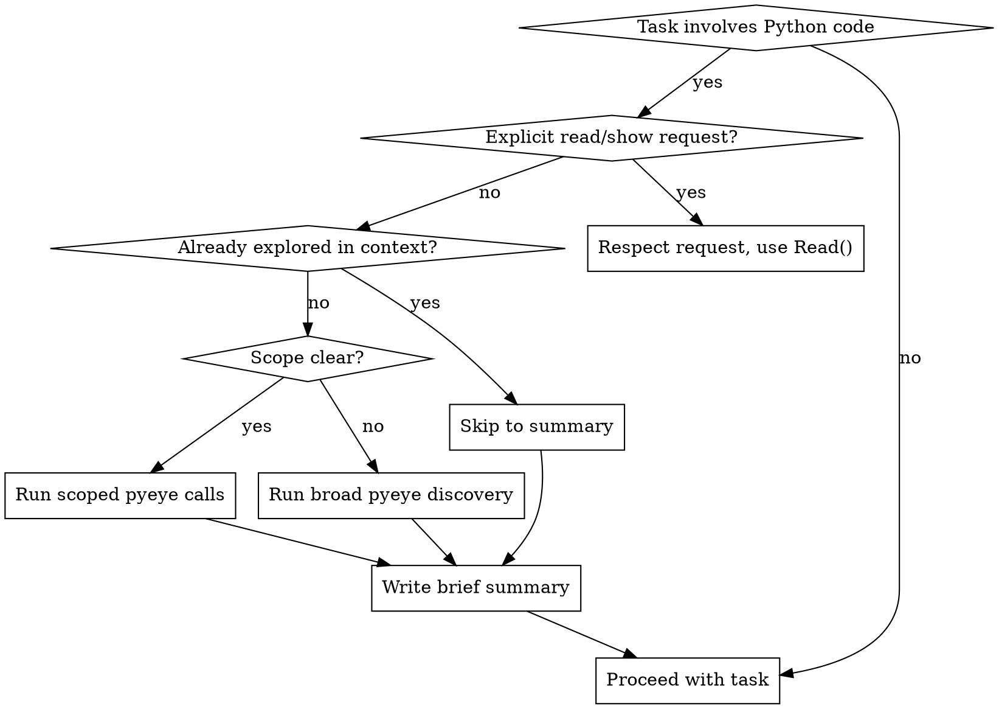

# Python Explore

Build a mental model with pyeye before touching Python code.

## Skill Type: Mixed Rigid/Flexible

**Rigid gates (non-negotiable):**

- Always produce a written summary before proceeding
- Always use pyeye before Read() on unfamiliar code
- Never re-explore what's already in context

**Flexible path (use judgement):**

- Depth scaling based on task scope
- Which specific pyeye calls to make
- When the mental model is "sufficient"

## Do NOT Trigger When

- User says "show me", "print", "display", "read this file" — respect explicit requests
- User says "run", "execute" — not exploration
- User asks "what's the syntax for" — language question, not codebase question
- Single-line typo/string fix where user gives exact location
- Adding a new test case (not modifying test infrastructure)
- Pyeye output for this module is already visible in conversation context

If pyeye output is already in context, skip to summary and proceed.

## Depth Scaling

| Task Scope | Pyeye Calls |
|------------|-------------|
| Single class/function change | `get_module_info()` + `find_references()` |
| Cross-module change | Add `analyze_dependencies()` |
| "I don't know where to start" | Full: `list_project_structure()` → `list_modules()` → drill down |

Never run `list_project_structure()` for a scoped single-symbol task.

## Relationship Queries Require Pyeye, Not Grep

**These patterns require `find_references` or `get_call_hierarchy`, NEVER Grep:**

- "Find classes that consume/use X"
- "Which code references this symbol"
- "Find classes where field contains/equals X"
- "Who calls this function"
- "What depends on this"

**Why:** Grep does text matching and misses semantic relationships (inheritance, imports, indirect references). Pyeye follows the actual reference graph.

### Example: "Find classes that consume api_mesh"

Step 1: `pyeye.find_symbol(name="api_mesh")` → note the file, line, column from result
Step 2: `pyeye.find_references(file=<from step 1>, line=<from step 1>, column=<from step 1>)` → all consumers

This two-step chain is required because find_references needs exact coordinates to trace the reference graph.

## Exit Criteria

Mental model is sufficient when you can answer:

- What is this thing?
- What does it depend on?
- What would break if I change it?

This is a judgement call, not a checklist. Explain at least one decision with "because" or "so that".

## Workflow



## Summary Format

**MANDATORY:** Always output before proceeding. All four fields are NON-NEGOTIABLE:

```markdown
**Mental Model: [symbol/module name]**
- Location: `path/to/file.py:line`
- Dependencies: [key imports/bases]
- Impact: [what uses this / what would break]
- Done when: All callers identified and impact understood; changes can proceed safely
```

**CRITICAL: Every class referenced in the summary MUST include:**

- **Fully Qualified Name (FQN):** e.g., `aac.logical.patterns.common.cdis.components.api_mesh`
- **File path with line number:** e.g., `aac/logical/patterns/common/cdis/components.py:13`

Never reference a class with only a name, only a line number, or only a module path. Both FQN and file:line are required for every class to make the summary actionable.

This creates an audit trail the user can correct if wrong.

## Pyeye Tool Reference

| Purpose | Tool |
|---------|------|
| Module structure | `pyeye.get_module_info(module_path="...")` |
| Find usages | `pyeye.find_references(file="...", line=X, column=Y)` |
| Dependency graph | `pyeye.analyze_dependencies(module_path="...")` |
| Project layout | `pyeye.list_project_structure(max_depth=3)` |
| All modules | `pyeye.list_modules()` |
| Symbol location | `pyeye.find_symbol(name="X")` |
| Inheritance | `pyeye.find_subclasses(base_class="X")` |
| Call chain | `pyeye.get_call_hierarchy(function_name="X")` |

## Failure Mode

If pyeye is unavailable (server down, tools not responding):

1. Note explicitly: "pyeye unavailable — falling back to Read()"
2. Proceed with Read()
3. Warn that static analysis is unavailable

Do not block — degrade gracefully but make the limitation visible.

## Red Flags — You're About to Violate This Skill

- First tool call is Read() on a Python file you haven't explored
- Reaching for Grep to find a class/function definition
- Reaching for Grep to find relationships (see "Relationship Queries" section above)
- "Let me just quickly read this file" without pyeye context
- Modifying code without knowing what depends on it

**If you catch yourself doing any of these: STOP. Run pyeye first.**
